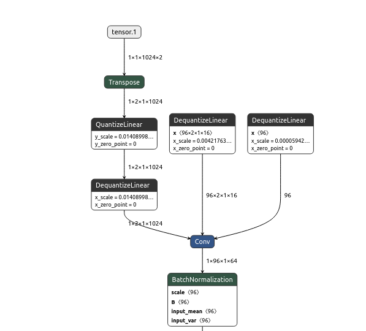
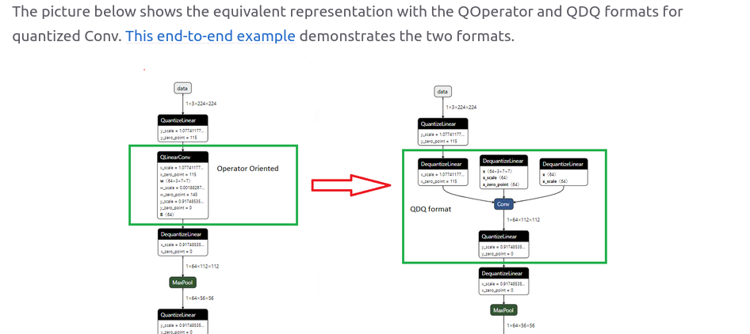

# Problem:
2026-04-15 17:29:35.454313044 [W:onnxruntime:Default, conv.cc:425 UpdateState] OP Conv(/emb/emb.1/patches/patches.1/Conv) running in Fallback mode. May be extremely slow.
# Set quantize bias parameter in export
- beim export export_onnx_qcdq -> quantize_bias=True
    - macht keinen unterschied, der bias wird nicht quantisiert

# Set bias true in embeddings.py (training)

## Do it like in the brevitas doku
Brevitas Doku: https://xilinx.github.io/brevitas/v0.12.1/tutorials/quant_tensor_quant_conv2d_overview.html
Onnx QDQ Format for Convolutions doku: https://onnxruntime.ai/docs/performance/model-optimizations/quantization.html
- LazyQuantConv2d: 
    - bias=True
    - bias_quant=Int8Bias (from brevitas.quant.scaled_int import Int8Bias)

Error while training:
```shell
raise RuntimeError("Input scale required")
RuntimeError: Input scale required
```
-> expects a quantized input -> set return_quant_tensor to true
``` python
*([QuantIdentity(bit_width=bits, return_quant_tensor=True)] if bits else []),
LazyQuantConv2d(dim, kernel_size, **kwargs, **weight_quant, bias_quant=Int8Bias,return_quant_tensor=True), 
```

The training, export and inference is working now in general, but the error from the beginning is still there.

Netron Screenshot of Radioml Model:




The warning in onnxruntime is still there, even if the format now aligns with the onnx screenshot with the correct quantized convolution:

Netron Screenshot in ORT Doku:




2026-04-22 09:51:33.129996076 [W:onnxruntime:Default, conv.cc:425 UpdateState] OP Conv(/emb/emb.1/patches/patches.1/Conv) running in Fallback mode. May be extremely slow.


## Viele ONNX Runtime backends erwarten int32 bias.
from brevitas.quant.scaled_int import Int32Bias

2026-04-22 10:18:49.669988554 [W:onnxruntime:, transformer_memcpy.cc:74 ApplyImpl] 1 Memcpy nodes are added to the graph main_graph for CUDAExecutionProvider. It might have negative impact on performance (including unable to run CUDA graph). Set session_options.log_severity_level=1 to see the detail logs before this message.

2026-04-22 10:18:49.999200573 [W:onnxruntime:Default, conv.cc:425 UpdateState] OP Conv(/emb/emb.1/patches/patches.1/Conv) running in Fallback mode. May be extremely slow.

does not work

## Batch Norm after Conv
export_onnx_qcdq(..., fold_batch_norm=True)

-> error is still there
2026-04-22 10:34:15.130931783 [W:onnxruntime:Default, conv.cc:425 UpdateState] OP Conv(/emb/emb.1/patches/patches.1/Conv) running in Fallback mode. May be extremely slow.

## test ohne quantisierung
measure) hanna@ceg-391:~/git/finn-transformers$ python3 -m measure.measure_onnxruntime
/data/gitlab/venvs/measure/lib/python3.10/site-packages/dvclive/monitor_system.py:11: FutureWarning: The pynvml package is deprecated. Please install nvidia-ml-py instead. If you did not install pynvml directly, please report this to the maintainers of the package that installed pynvml for you.
  from pynvml import (
FP32
GPU memory budget: 32.00 GB (34359738368 bytes)
batch_size           : 1
input_info           : [{'name': 'input', 'shape': ['batch_size', 1, 1024, 2], 'dtype': 'tensor(float)'}]
output_info          : [{'name': 'output', 'shape': ['batch_size', 24], 'dtype': 'tensor(float)'}]
data_path_npz        : /home/hanna/git/radioml-transformer/data/GOLD_XYZ_OSC.0001_1024.npz
onnx_model_path      : outputs/radioml/model_dynamic_batchsize.onnx
Available ORT providers: ['CUDAExecutionProvider', 'CPUExecutionProvider']
ORT session active providers: ['CUDAExecutionProvider', 'CPUExecutionProvider']
Keys in NPZ file: ['X', 'Y']
2026-04-22 14:52:59.936826862 [W:onnxruntime:Default, conv.cc:425 UpdateState] OP Conv(/emb/emb.1/patches/patches.0/Conv) running in Fallback mode. May be extremely slow.

--> Fehlermeldung ist immer noch da