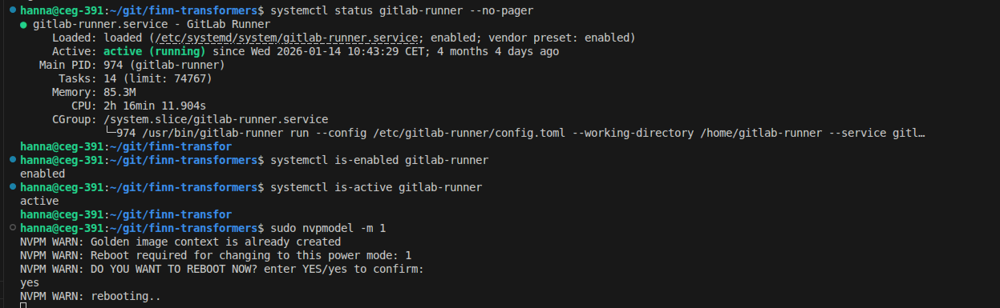

Powermodus ändern:

    2: 30 Watt
    1: 15 Watt
    3: 50 Watt
    0: no constraints (kann zu überhitzung kommen)


Change power mode:
```
sudo nvpmodel -q    # check power mode
sudo nvpmodel -m 2   # set mode (e.g., 15W)
sudo jetson_clocks

```
Restart is needed to change power mode. What happens if I restart the jetson?


test power modes with **normal radioml**:

    - 30 Watt
        - Commit: 34754810c11a7fdd3508db3884dfc6abacb2a442 [ci-127059-517947]
    - 15 Watt
        - Commit: 67f9e9f61b14ebc1e4fabf87453d5cfc82f590ac  NOT FOUND IN DVC [ci-127073-517969] , after committing and push its there again
    - 50 Watt
        - Commit: TODO (failed because of DVC)

test power modes with **normal vision**:

    - 30 Watt
        - Commit: a6be9bbd0c4f0e4232924989f39cae98da8bca12 NOT FOUND IN DVC [logs are full, cant see exp name]
    - 15 Watt (tag: git tag baseline-vision-15w)
        - Commit: 00ef7b8b0cb13f353944fba2f6870b6ba9f1ec9c NOT FOUND IN DVC [ci-127084-518006]
    - 50 Watt
        - Commit: 15c4feb163bd84b6eda0e39c7e3999b36b938684 [ci-128068-520744]


test power modes with **normal language**:

    - 30 Watt
        - Commit: b4ca7ae3dab21e9979f3d49f3b347e8a6381dbd6 NOT FOUND IN DVC [ci-127069-517964] NOW ITS IN DVC, after updating dvc datachain its not there anymore..., after commit and push its there (before the gitlab mirror has pulled the changes), after the pipeline in the gitlab mirror has begun: the commit is not there anymore!

        or [ci-128109-520914] (all batch sizes)
    - 15 Watt
        - Commit: c48b2ba3e62eead9dcd3ae07f31a9fecd6b3f706 NOT FOUND IN DVC [ci-127092-518035] NOW ITS IN DVC, not anymore now, after committing and push its there again, not there now
    - 50 Watt
        - Commit: d84b7381edf822ac7ae092b24a9a26756684c3c4 [ci-127257-518890]

Radioml (change model size, always with 30 Watt):

    - **normal**
        - num_layers:1
        - emb_dim: 96
        - num_heads: 3
        - expansion_dim: 512
        - Commit: 34754810c11a7fdd3508db3884dfc6abacb2a442 [ci-127059-517947]

    - bigger:
        - num_layers: 3
        - emb_dims: 128
        - num_heads: 4
        - expansion_dim: 512
        - Commit (30 Watt): 4dd0b68a4fc33ef228095d1fcff6a2c64ffe3981 [ci-128063-520725]
        - Commmit (50 Watt): e6da147df1da6788092118d9b2b241dcbd8b3ca3 [ci-127244-518854]
        - Commit (15 Watt): 0b21f8e27ca1bb6fd73031adb61ad2b9ffdf8c3d [ci-127253-518883]


    - bigger: train it again bc of bad accuracy, changed model.py:
        Patch Model to instantiate fresh block instances per layer (fix the list-multiplication bug) 

    - even bigger:
        - num_layers: 6
        - emb_dims: 128
        - num_heads: 4
        - expansion_dim: 512
        - Commit: 


        mehr heads testen


        - Vergleiche zusammenfügen (Dashboards selber erstellen, da ddatachain nicht zuverlässig alle commits hat!)
        - größere batch sizes language und vision


### How to get the plots of a specific experiment:

1. git fetch origin 'refs/exps/*:refs/exps/*'
2. dvc exp apply ci-128068-520744   
3. dvc pull -r upload

the files from the experiment should be in the outputs folder now.

4. git reset --hard HEAD


Folgender Command zeigt auf unterschiedlichen PCs (aber im gleichen branch im projekt, nach git pull und dvc pull) unterschiedliche experimente an:
dvc exp list -n 30


Todo:
- training auf cluster - trainingsdaten kopieren - started
- powermodus, taktfrequenz zusammenhang?
    - ja, dynamisch
    - sudo jetson_clocks   würde taktfrequenz auf maximum fixieren, das sollte zu höherem stromverbrauch führen
- dvc exp pull - done


comm -23 /tmp/remote_exps.txt /tmp/local_exps.txt | sed 's#^#refs/exps/#' | while read ref; do
  echo "fetching $ref" && git fetch origin "$ref:$ref"
done


dvc exp pull origin -A -r upload
dvc exp apply ci-128068-520744
find the plots under dvc/images/...

https://developer.ridgerun.com/wiki/index.php/NVIDIA_Jetson_Orin/JetPack_5.0.2/Performance_Tuning/Maximizing_Performance


# Bevor Clocks maximiert wurden, 30W:
sudo jetson_clocks --show
SOC family:tegra234  Machine:NVIDIA Jetson AGX Orin Developer Kit
Online CPUs: 0-7
cpu0:  Online=1 Governor=schedutil MinFreq=729600 MaxFreq=1728000 CurrentFreq=1420800 IdleStates: WFI=1 c7=1 
cpu1:  Online=1 Governor=schedutil MinFreq=729600 MaxFreq=1728000 CurrentFreq=729600 IdleStates: WFI=1 c7=1 
cpu2:  Online=1 Governor=schedutil MinFreq=729600 MaxFreq=1728000 CurrentFreq=1420800 IdleStates: WFI=1 c7=1 
cpu3:  Online=1 Governor=schedutil MinFreq=729600 MaxFreq=1728000 CurrentFreq=729600 IdleStates: WFI=1 c7=1 
cpu4:  Online=1 Governor=schedutil MinFreq=729600 MaxFreq=1728000 CurrentFreq=1497600 IdleStates: WFI=1 c7=1 
cpu5:  Online=1 Governor=schedutil MinFreq=729600 MaxFreq=1728000 CurrentFreq=729600 IdleStates: WFI=1 c7=1 
cpu6:  Online=1 Governor=schedutil MinFreq=729600 MaxFreq=1728000 CurrentFreq=1497600 IdleStates: WFI=1 c7=1 
cpu7:  Online=1 Governor=schedutil MinFreq=729600 MaxFreq=1728000 CurrentFreq=729600 IdleStates: WFI=1 c7=1 
cpu8:  Online=0 Governor=schedutil MinFreq=729600 MaxFreq=2201600 CurrentFreq=729600 IdleStates: WFI=1 c7=1 
cpu9:  Online=0 Governor=schedutil MinFreq=729600 MaxFreq=2201600 CurrentFreq=729600 IdleStates: WFI=1 c7=1 
cpu10: Online=0 Governor=schedutil MinFreq=729600 MaxFreq=2201600 CurrentFreq=729600 IdleStates: WFI=1 c7=1 
cpu11: Online=0 Governor=schedutil MinFreq=729600 MaxFreq=2201600 CurrentFreq=729600 IdleStates: WFI=1 c7=1 
GPU MinFreq=306000000 MaxFreq=612000000 CurrentFreq=306000000
Active GPU TPCs: 4
EMC MinFreq=204000000 MaxFreq=3199000000 CurrentFreq=3199000000 FreqOverride=0
DLA0_CORE:   Online=1 MinFreq=0 MaxFreq=1369600000 CurrentFreq=1369600000
DLA0_FALCON: Online=1 MinFreq=0 MaxFreq=729600000 CurrentFreq=729600000
DLA1_CORE:   Online=1 MinFreq=0 MaxFreq=1369600000 CurrentFreq=1369600000
DLA1_FALCON: Online=1 MinFreq=0 MaxFreq=729600000 CurrentFreq=729600000
PVA0_VPS0: Online=1 MinFreq=0 MaxFreq=512000000 CurrentFreq=512000000
PVA0_AXI:  Online=1 MinFreq=0 MaxFreq=358400000 CurrentFreq=358400000
FAN Dynamic Speed Control=nvfancontrol hwmon0_pwm1=48
NV Power Mode: MODE_30W
# Nachdem Clocks maximiert wurden, 30W:
hanna@ceg-391:~/git/finn-transformers$ sudo jetson_clocks
hanna@ceg-391:~/git/finn-transformers$ sudo jetson_clocks --show
SOC family:tegra234  Machine:NVIDIA Jetson AGX Orin Developer Kit
Online CPUs: 0-7
cpu0:  Online=1 Governor=schedutil MinFreq=1728000 MaxFreq=1728000 CurrentFreq=1728000 IdleStates: WFI=0 c7=0 
cpu1:  Online=1 Governor=schedutil MinFreq=1728000 MaxFreq=1728000 CurrentFreq=1728000 IdleStates: WFI=0 c7=0 
cpu2:  Online=1 Governor=schedutil MinFreq=1728000 MaxFreq=1728000 CurrentFreq=1728000 IdleStates: WFI=0 c7=0 
cpu3:  Online=1 Governor=schedutil MinFreq=1728000 MaxFreq=1728000 CurrentFreq=1728000 IdleStates: WFI=0 c7=0 
cpu4:  Online=1 Governor=schedutil MinFreq=1728000 MaxFreq=1728000 CurrentFreq=1728000 IdleStates: WFI=0 c7=0 
cpu5:  Online=1 Governor=schedutil MinFreq=1728000 MaxFreq=1728000 CurrentFreq=1728000 IdleStates: WFI=0 c7=0 
cpu6:  Online=1 Governor=schedutil MinFreq=1728000 MaxFreq=1728000 CurrentFreq=1728000 IdleStates: WFI=0 c7=0 
cpu7:  Online=1 Governor=schedutil MinFreq=1728000 MaxFreq=1728000 CurrentFreq=1728000 IdleStates: WFI=0 c7=0 
cpu8:  Online=0 Governor=schedutil MinFreq=729600 MaxFreq=2201600 CurrentFreq=729600 IdleStates: WFI=0 c7=0 
cpu9:  Online=0 Governor=schedutil MinFreq=729600 MaxFreq=2201600 CurrentFreq=729600 IdleStates: WFI=0 c7=0 
cpu10: Online=0 Governor=schedutil MinFreq=729600 MaxFreq=2201600 CurrentFreq=729600 IdleStates: WFI=0 c7=0 
cpu11: Online=0 Governor=schedutil MinFreq=729600 MaxFreq=2201600 CurrentFreq=729600 IdleStates: WFI=0 c7=0 
GPU MinFreq=612000000 MaxFreq=612000000 CurrentFreq=612000000
Active GPU TPCs: 4
EMC MinFreq=204000000 MaxFreq=3199000000 CurrentFreq=3199000000 FreqOverride=1
DLA0_CORE:   Online=1 MinFreq=0 MaxFreq=1369600000 CurrentFreq=1369600000
DLA0_FALCON: Online=1 MinFreq=0 MaxFreq=729600000 CurrentFreq=729600000
DLA1_CORE:   Online=1 MinFreq=0 MaxFreq=1369600000 CurrentFreq=1369600000
DLA1_FALCON: Online=1 MinFreq=0 MaxFreq=729600000 CurrentFreq=729600000
PVA0_VPS0: Online=1 MinFreq=0 MaxFreq=512000000 CurrentFreq=512000000
PVA0_AXI:  Online=1 MinFreq=0 MaxFreq=358400000 CurrentFreq=358400000
FAN Dynamic Speed Control=nvfancontrol hwmon0_pwm1=48
NV Power Mode: MODE_30W


- power modus mit clock max testen
- trainieren und lernrate variieren auf cluster
- aufräumen (alte pngs löschen)
- plots sind im report!!
- Wo sind die richtigen jsons zum experiment?